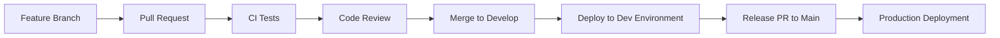

# 🚀 Getting Started with GitHub Workflows

Welcome! This project is your complete guide to learning and practicing GitHub workflows with a real API service.

## 📖 What You've Built

You now have a **production-ready NestJS API service** that demonstrates:

✅ **Environment-aware API endpoints**  
✅ **Docker containerization**  
✅ **GitHub Actions CI/CD pipelines**  
✅ **Multi-environment deployment (dev/prod)**  
✅ **Comprehensive testing suite**  
✅ **Branch protection and code review workflows**

## 🎯 Next Steps

### 1. Test Your API Locally

```bash
# Start the development server
npm run start:dev

# Test the endpoints
curl http://localhost:3000/         # Hello World
curl http://localhost:3000/env      # Environment info
curl http://localhost:3000/health   # Health check
```

### 2. Push to GitHub

```bash
# Initialize git (if not already done)
git init
git add .
git commit -m "Initial commit: Complete GitHub workflow setup"

# Add your GitHub repository
git remote add origin https://github.com/yourusername/your-repo-name.git
git push -u origin main
```

### 3. Set Up GitHub Environments

Follow the [**GitHub Setup Guide**](./docs/github-setup-guide.md) to:

- Create development and production environments
- Set up branch protection rules
- Configure GitHub secrets
- Enable automated deployments

### 4. Create Your First Feature

```bash
# Create development branch
git checkout -b develop
git push -u origin develop

# Create a feature branch
git checkout -b feature/my-new-endpoint

# Make changes, commit, and push
git add .
git commit -m "Add new feature"
git push -u origin feature/my-new-endpoint

# Create a Pull Request to 'develop' branch
```

## 🔄 Workflow in Action

Once set up, here's how your workflow will work:



### Development Workflow

1. **Feature Branch** → **PR to develop** → **CI runs** → **Review** → **Merge**
2. **Auto-deploy** to development environment
3. **Environment protection**: None (fast iteration)

### Production Workflow

1. **Develop** → **PR to main** → **CI runs** → **Review** → **Approval required**
2. **Auto-deploy** to production environment
3. **Environment protection**: Requires approval + passing tests

## 📋 Available Scripts

| Command               | What it does                             |
| --------------------- | ---------------------------------------- |
| `npm run start:dev`   | Start development server with hot reload |
| `npm test`            | Run unit tests                           |
| `npm run test:e2e`    | Run end-to-end tests                     |
| `npm run build`       | Build for production                     |
| `npm run docker:dev`  | Run in Docker (development)              |
| `npm run docker:prod` | Run in Docker (production)               |

## 🎓 Learning Objectives Covered

By completing this setup, you've learned:

- ✅ **CI/CD Pipelines** - Automated testing and deployment
- ✅ **Environment Management** - Separate dev/prod configurations
- ✅ **Branch Protection** - Code review and quality gates
- ✅ **GitHub Environments** - Deployment approvals and secrets
- ✅ **Docker Containerization** - Consistent deployment packaging
- ✅ **API Development** - Environment-aware endpoints
- ✅ **Testing Strategies** - Unit and integration tests

## 🔍 Key Files to Understand

| File                                | Purpose                 |
| ----------------------------------- | ----------------------- |
| `.github/workflows/ci.yml`          | Runs tests on every PR  |
| `.github/workflows/deploy-dev.yml`  | Deploys to development  |
| `.github/workflows/deploy-prod.yml` | Deploys to production   |
| `Dockerfile`                        | Container configuration |
| `docker-compose.yml`                | Multi-environment setup |
| `src/app.controller.ts`             | API endpoints           |
| `src/app.service.ts`                | Business logic          |

## 🚨 Important Notes

1. **Never commit secrets** - Use GitHub secrets and environment variables
2. **Test locally first** - Always test before pushing
3. **Small commits** - Make focused, reviewable changes
4. **Descriptive PRs** - Help reviewers understand your changes

## 🤝 Getting Help

- **Documentation**: Check [docs/github-setup-guide.md](./docs/github-setup-guide.md)
- **Environment Config**: See [config/environment-guide.md](./config/environment-guide.md)
- **GitHub Actions**: View the Actions tab in your repository
- **API Testing**: Use the `/health` endpoint to verify deployments

## 🎉 Congratulations!

You now have a **complete GitHub workflow setup** that follows industry best practices. This foundation will serve you well for any future projects.

**Ready to deploy?** Follow the GitHub Setup Guide to get your workflows running! 🚀
